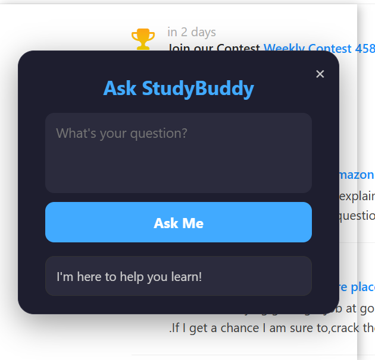
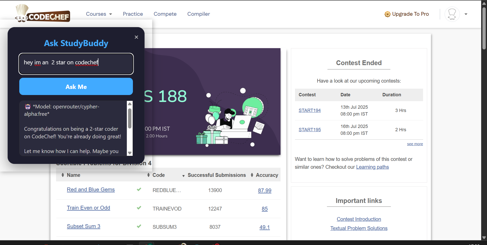

# 🧠 StudyBuddy – Your Personal Coding Sidekick (Chrome Extension)

Ever been stuck on a coding problem late at night?  
Yeah… me too.

**StudyBuddy** is a Chrome extension I built to help students (like myself) get quick, intelligent help without switching tabs or drowning in forums. It pops up right on your screen — ask it anything about code, DSA, or concepts — and boom 💥 instant AI support.

---

## 💡 What is StudyBuddy?

It's a lightweight, AI-powered popup that you can open on any educational website like LeetCode, GeeksforGeeks, etc. You type your question → it replies with explanations, solutions, or just clears your confusion.

No clutter. No distractions. Just help when you need it.

---

## 🔥 Features

- 🖱️ Click-to-open popup on any webpage
- ⚙️ Works across multiple AI models (auto-fallback system)
- 📚 Solves code problems, explains concepts, debugs logic
- ❌ Close/shrink when not needed
- 🎓 Built by a student, for students

---

## 🤖 Free AI Models Used

If one model hits its limit, StudyBuddy automatically switches to the next:

- `openrouter/cypher-alpha:free`
- `tngtech/deepseek-r1t2-chimera:free`
- `mistralai/mistral-small-3.2-24b-instruct:free`
- `deepseek/deepseek-r1-0528-qwen3-8b:free`
- `deepseek/deepseek-r1-0528:free`

---

## ✨ Demo / Screenshots

| Popup View | Answer in Action |
|------------|------------------|
|  |  |

---

## 🛠️ How to Use

1. Clone or download this repo.
2. Go to `chrome://extensions` in your browser.
3. Turn on **Developer Mode** (top right).
4. Click **Load Unpacked** and select the `StudyBuddy` folder.
5. You’re good to go! Click the icon and start asking.

---

## 🔐 Setup Your API Key (OpenRouter)

1. Go to [https://openrouter.ai](https://openrouter.ai) and get a free API key.
2. Open `panel.js`.
3. Replace the API key line:

```js
const apiKey = "your-api-key-here";
